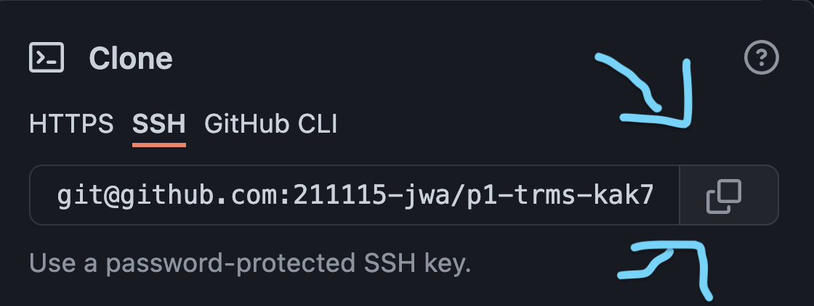

# Tuition Reimbursement Management System

The goal of this project is to work with Agile methodology, testing (unit, integration, and e2e), and front end technologies.<br><br>
The purpose of TRMS is to provide a system that encourages quality knowledge growth relevant to an individual’s expertise.  In order to access the TRMS all employees have the ability to log in and out.  Each employee is allowed to claim up to $1000 in tuition reimbursement a year.  Event types have different standard reimbursement coverage: University Courses 80%, Seminars 60%, Certification Preparation Classes 75%, Certification 100%, Technical Training 90%, Other 30%.  All Employees must complete the Tuition Reimbursement form one week prior to the start of the event.  This form must collect: basic employee information; date, time, location, description, cost, grading format, and type of event.  Grading formats are pulled from a reference table.  Tuition Reimbursement form is assigned Pending Approval by Supervisor immediately upon submission of form (unless applicant is a supervisor, manager or the Benefits Coordinator -- BenCo).  After the supervisor approves a claim the Tuition Reimbursement form is assigned Pending Approval by Manager and after the manager approves a claim it is assigned Pending Approval by BenCo.


## Technologies Used

-------------

* AWS RDS PostgreSQL 12
* Java 8
* JUnit 5
* Mockito 4
* Cucumber 7
* Selenium 4
* HTML 5 with CSS
* JavaScript EMCA 6

## Features

-------------

List of features ready and TODOs for future development

* Employees can Log In and Out
* Supervisors can Log In and Out
* All TRMS Reimbursement Requests can be viewed
* Employees can view Their Own submitted TRMS Reimbursement Requests
* Supervisors can view Their Own submitted TRMS Reimbursement Requests
* Supervisors can view The TRMS Reimbursement Requests They need to Approve/Deny
* DAO JUnit tests are successful
* Service JUnit/Mockito tests are successful

To-do list:

* As an Employee I can submit a TRMS Reimbursement Request
* As a Supervisor I can  Approve/Deny a TRMS Reimbursement Request
* Get Cucumber/Selenium tests running successfully

## Getting Started

------------------


1. Go to your Documents folder
2. Make a new folder
3. Rename your new folder "TRMS"

**If You Have a Windows Computer**

4. Open a new Command Prompt in your TRMS folder like this. <br><br> 

**If You Have a Mac**

4. Open a new terminal in your TRMS folder like this. <br><br> 

**Joint Instructions**

5. Go to this project's GitHub [page](https://github.com/211115-jwa/p1-trms-kak79) and clicking on the green code button. <br><br> 
6. Most of you want HTTPS
7. Click the double boxes to copy this command. <br><br> 

**If You Have a Windows Computer**

8. Go back to your command prompt that you opened in step 4.

**If You Have a Mac**

8. Go back to your terminal that you opened in step 4.

**Joint Instructions**

9. Type
```
git clone [paste url here]
```
- Now we check if you have Java and if you do, which version.
10. In your command prompt/terminal type:
```
javac -version
```
11. It should look something like this. <br><br> 
12. If there is no return value or the version number is below 8 go [here](https://www3.ntu.edu.sg/home/ehchua/programming/howto/JDK_Howto.html). Follow the instructions for your operating system.
13. Next you will install PostgreSQL from [here](https://www.postgresqltutorial.com/install-postgresql/).  Follow the instructions for your operating system.
14. 
15. 
16. 
17. 
18. 
19. 
20. 
21. 
22. 
23. 
24. 
25. 
26. 
27. 
28. 
29. In step 9. you cloned the repository into your new folder TRMS.  Now that you have Java installed on your system, you are going to open the 


(include git clone command) (include all environment setup steps)

Be sure to include BOTH Windows and Unix command
Be sure to mention if the commands only work on a specific platform (eg. AWS, GCP)

All the code required to get started
Images of what it should look like
Usage
Here, you instruct other people on how to use your project after they’ve installed it. This would also be a good place to include screenshots of your project in action.

## License

---------

This project uses the following license: <license_name>.

